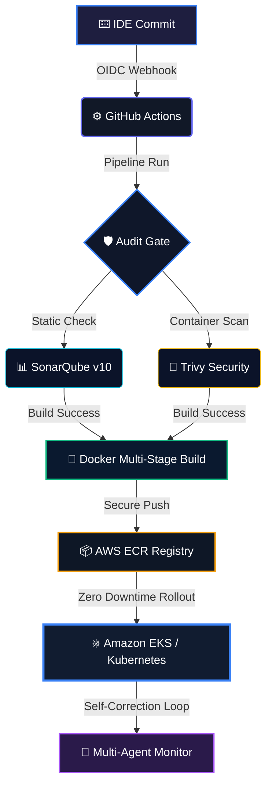

# 🌌 PRAJWAL B | DevOps & GenAI Engineer

<p align="center">
  
</p>

<p align="center">
  <a href="https://linkedin.com/in/yes" target="blank">
    
  </a>
  
  <a href="mailto:aigocraftedinfo@gmail.com" target="blank">
    
  </a>
</p>

---

## ⚡ Live Automated System Telemetry

```tbl
+-----------------------------------------------------------------------------------------+
| SYSTEM CLOUD NODE: online (aws-us-east-1)                                               |
| CURRENT ENGINE: Docker Rootless Core Node 3000                                          |
| ACTIVE STATUS: Monitoring automated self-healing CI/CD, GitOps, and Agentic Pipelines  |
+-----------------------------------------------------------------------------------------+
```

<p align="center">
  
  
</p>

---

## 🚀 Interactive GitOps & CI/CD Pipeline Status
Here is a live layout simulating our daily infrastructure orchestration:



---

## 🛠️ Specialized Technical Arsenal

### ☁️ Cloud Architecture & Automated Orchestration
<table>
  <tr>
    <td align="center" width="180">
      
      <br /><strong>AWS Cloud</strong>
      <br />
    </td>
    <td align="center" width="180">
      
      <br /><strong>Terraform</strong>
      <br />
    </td>
    <td align="center" width="180">
      
      <br /><strong>Linux Core</strong>
      <br />
    </td>
  </tr>
</table>

### 🚀 Continuous Integration & Delivery Automation (CI/CD)
<table>
  <tr>
    <td align="center" width="180">
      
      <br /><strong>Jenkins DSL</strong>
      <br />
    </td>
    <td align="center" width="180">
      
      <br /><strong>GitHub Actions</strong>
      <br />
    </td>
    <td align="center" width="180">
      
      <br /><strong>Apache Maven</strong>
      <br />
    </td>
  </tr>
</table>

### 🛡️ DevSecOps, Dynamic Scanners & Code Cleanliness
<table>
  <tr>
    <td align="center" width="180">
      
      <br /><strong>SonarQube</strong>
      <br />
    </td>
    <td align="center" width="180">
      
      <br /><strong>OWASP ZAP</strong>
      <br />
    </td>
    <td align="center" width="180">
      
      <br /><strong>Trivy Scan</strong>
      <br />
    </td>
  </tr>
</table>

### 📦 Containers & Cloud-Native Scaling
<table>
  <tr>
    <td align="center" width="270">
      
      <br /><strong>Docker</strong>
      <br />
    </td>
    <td align="center" width="270">
      
      <br /><strong>Kubernetes EKS</strong>
      <br />
    </td>
  </tr>
</table>

### 🧠 Intelligent Conversational AI & Agent-Based Architectures
<table>
  <tr>
    <td align="center" width="180">
      
      <br /><strong>Python</strong>
      <br />
    </td>
    <td align="center" width="180">
      
      <br /><strong>LangChain</strong>
      <br />
    </td>
    <td align="center" width="180">
      
      <br /><strong>LangGraph</strong>
      <br />
    </td>
  </tr>
  <tr>
    <td align="center" width="180" colspan="1.5">
      <br /><strong>RAG Applications</strong>
      <br />
    </td>
    <td align="center" width="180" colspan="1.5">
      <br /><strong>Agentic Engineering</strong>
      <br />
    </td>
  </tr>
</table>

### 📊 SQL & Advanced Enterprise Business Analytics
<table>
  <tr>
    <td align="center" width="180">
      
      <br /><strong>SQL Core</strong>
      <br />
    </td>
    <td align="center" width="180">
      
      <br /><strong>Advanced Excel</strong>
      <br />
    </td>
    <td align="center" width="180">
      
      <br /><strong>PowerBI</strong>
      <br />
    </td>
  </tr>
</table>

---

## 📈 System Metrics & Active Diagnostics

<p align="center">
  
  <br /><br />
  
  <br /><br />
  
</p>

---

## 📅 Contributions in the Last Year

<p align="center">
  
</p>

<p align="center">
  
</p>

---

## 🏆 Dynamic Meritorious Badges
<p align="center">
  <a href="https://github.com/ryo-ma/github-profile-trophy">
    
  </a>
</p>

---

## 📟 Operations Console Terminal log

```bash
$ prajwal --version
prajwal-devops-core version 3.5.2 (Stable-Agent-Build)
$ prajwal sys-info --detailed
+-------------------+----------------------------+
| METRIC            | CURRENT VALUE              |
+-------------------+----------------------------+
| Developer Name    | PRAJWAL B                  |
| Focus Realm       | DevOps & Generative AI     |
| Operations Mode   | Zero-Downtime Agent Loop   |
| Core Systems      | AWS, Terraform, Kubernetes |
| AI Synthesizers   | LangGraph Agent Workflows  |
| Main Objectives   | Build bulletproof systems  |
+-------------------+----------------------------+
$ echo "Telemetry Nominal. Ready for custom orchestration deployments."
```

*(This impressive profile file was created automatically by the DevOps Profile README Architect)*
